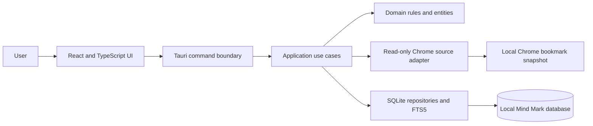

# Mind Mark Architecture

## Status and Scope

This document describes the architecture of the initial Mind Mark implementation. The repository now has a Tauri 2 + React/TypeScript desktop scaffold, a Rust core crate, and SQLite-backed Chrome intake and bookmark management. Some planned features remain unimplemented.

Initial support is Windows, Chrome, and local SQLite. The application imports Chrome bookmarks one way and does not modify Chrome data. Future operating systems, browsers, cloud storage, vector search, and bidirectional sync must not become dependencies of the initial release.

## Architectural Goals

- Protect user bookmark data and make ingestion repeatable and recoverable.
- Keep the first release simple to build, test, and run locally.
- Preserve domain rules when UI, browser sources, or persistence adapters change.
- Support multiple thousands of bookmarks with indexed search and measured performance.
- Make future integrations possible through stable boundaries without building unused infrastructure now.

## Recommended Stack

| Concern | Starting choice |
| --- | --- |
| Desktop shell | Tauri 2 |
| UI | React + TypeScript |
| Application core | Rust |
| Metadata storage | SQLite with versioned migrations |
| Initial text index | SQLite FTS5 |
| Initial vector search | Deferred; no vector dependency in MVP |

Treat this stack as the agreed starting direction. Confirm specific libraries and versions during scaffolding and record consequential changes here.

## Implementation Status

- **Foundation:** Tauri/React scaffold, Rust core crate, SQLite startup initialization, and the first schema migration are present.
- **Chrome intake:** Windows profile discovery, read-only snapshot parsing, tree preservation, transactional idempotent sync, and non-destructive stale reporting are present.
- **Bookmark management:** App-profile selection, folder navigation, bookmark create/edit/archive, and tags/categories are present.
- **Not yet implemented:** FTS5 query UI, JSON/CSV import/export, duplicate review/merge, health checks, backup/restore, vector search, and bidirectional sync.
- **Validation caveat:** Frontend production builds pass. The full Tauri desktop build needs platform GTK/WebKit dependencies under WSL; the latest bookmark CRUD Rust test was not rerun after its mutex fix.

## System Context



The browser adapter reads a snapshot from a selected Chrome profile. Chrome's own Google account sync remains outside Mind Mark. The application stores its own canonical data in SQLite; FTS5 is a derived index that can be checked and rebuilt.

## Dependency Boundaries

### Domain

Owns bookmark, source, folder-tree, category, tag, profile, and sync/import result concepts, along with invariants such as source identity and safe merge behavior. It must not depend on Tauri, React, Chrome paths, SQLite, or a particular search engine.

### Application

Coordinates use cases: discover/select source, sync/import, browse/edit bookmarks, search/filter, export, detect/merge duplicates, configure the app, and run health checks. It owns transaction boundaries and calls narrow ports for source access, repositories, file formats, and search where replacement is meaningful.

### Infrastructure

Implements the external boundaries:

- **Chrome adapter:** Windows profile discovery and read-only bookmark snapshot parsing.
- **SQLite adapter:** Database initialization, migrations, repositories, constraints, transactions, and FTS5 maintenance.
- **File-format adapters:** Versioned JSON and documented CSV parsing/writing.
- **Future adapters:** Other browsers, operating-system-specific source discovery, cloud metadata storage, and embedding/vector providers, introduced only when scheduled.

### Desktop/UI Boundary

Tauri commands should validate and translate requests, invoke application use cases, and return typed results. They should not contain SQL or business rules. The React UI should display application results and progress without directly accessing Chrome files or the database.

## Proposed Project Structure

```text
mind-mark/
  src/                              # React + TypeScript UI
    app/                            # App bootstrap and navigation
    features/
      bookmarks/                    # Tree/list, details, editing
      search/                       # Query, filters, result views
      profiles/                     # Chrome sources and app scopes
      categories/
      tags/
      imports/                      # Import/export flows and reports
      health/                       # Database/index checks and repair
    shared/                         # UI primitives and typed command client
  src-tauri/
    src/
      domain/                       # Entities, value types, invariants
      application/                  # Use cases and ports
      infrastructure/
        chrome/                     # Profile discovery and snapshot parser
        sqlite/                     # Connection, repositories, FTS5
        file_formats/               # JSON and CSV adapters
      commands/                     # Tauri command handlers
    migrations/                     # Versioned SQL migrations
    tests/                          # Integration tests and fixtures
  tests/
    fixtures/                       # Sanitized Chrome/import samples
  docs/                             # Format contracts and architecture records
```

Adapt this structure to the generated Tauri scaffold and actual crate/package conventions. Do not create empty modules solely to match this diagram.

## Core Data Concepts

- **App profile:** Mind Mark's user-facing scope or workspace.
- **Bookmark source:** A browser profile or later external source, with stable source identity and sync status.
- **Bookmark:** Canonical Mind Mark record with stable internal ID, original URL, searchable fields, and app-profile ownership.
- **Source bookmark:** Link between a canonical bookmark and a source-specific bookmark ID. Enforce uniqueness within a source for idempotent sync.
- **Folder:** Hierarchical source organization, retaining parent and sibling order where available.
- **Category and tag:** App-managed classification, independent of the imported Chrome folder tree.
- **Sync/import run:** Status, timestamps, counts, warnings, and recoverable error information.
- **Search index:** Derived/rebuildable representation of canonical searchable fields, not a source of truth.

Keep app profiles distinct from Chrome profiles in the model, even if initial onboarding maps one Chrome profile to one app profile. Preserve source provenance if multiple sources eventually refer to one logical bookmark.

## Chrome Intake and Sync Semantics

The initial sync direction is **Chrome to Mind Mark only**:

1. Discover likely local Chrome profiles and allow manual profile selection.
2. Read bookmark data as a snapshot; do not write to Chrome files or call Google account APIs.
3. Parse and validate the snapshot before database mutation. Report malformed entries while retaining valid entries when safe.
4. Preview the source, target app profile, bookmark count, and folder tree.
5. Upsert in a transaction using `(source_id, source_bookmark_id)` as the source identity key.
6. Record added, updated, unchanged, and missing/stale counts with warnings and errors.
7. Do not automatically delete app records absent from a snapshot. Any later deletion/archive policy must be explicit and reversible.

Start with user-triggered sync. Validate behavior with Chrome running on supported Windows configurations; copy the source file to a temporary snapshot if required for consistent parsing. Add background sync only after idempotency, cancellation, and recovery are established.

Bookmark edits made in Mind Mark remain local in the initial release. Bidirectional sync is future scope and requires conflict resolution, deletion semantics, and source ownership rules before implementation.

## Storage, Indexing, and Concurrency

- Use versioned SQLite migrations from the first schema; enforce foreign keys and add indexes for profile, source identity, folder parent/order, normalized URL, and common filters.
- Store original URLs unchanged. Keep matching normalization separate and conservative; never silently rewrite the user's URL.
- Keep canonical bookmark data in relational tables. Maintain FTS5 transactionally or with a documented rebuild strategy.
- Enable and verify foreign keys, WAL mode, and a bounded busy timeout during database initialization.
- Serialize sync/import/merge writes through one application-level writer queue. Keep transactions short, permit reads where the database binding supports them, and never wait for user input inside a write transaction.
- Parse/validate input before opening the write transaction. Use bounded transactional batches only if collection size measurements require them.
- Add checks for schema version, foreign-key integrity, stale runs, and FTS5 consistency, with a safe rebuild action.
- Benchmark representative collections larger than the expected several thousand before introducing caching or changing database technology.

## Search and Vectorization

MVP search uses FTS5 for text and ordinary SQL predicates for profile, folder, category, and tag filters. Define ranking/tokenization behavior in tests. Search results must be reproducible from canonical SQLite data after a full index rebuild.

Semantic/vector search is deferred. When prioritized, add an embedding provider and vector-store boundary outside domain rules; store model/version metadata so embeddings can be regenerated. Embedding failures must not block bookmark management or text search. Evaluate local inference and privacy before considering hosted processing.

## Import, Export, Duplicate Review, and Health

- Define a versioned JSON format that preserves supported hierarchy and app metadata.
- Define a Mind Mark CSV schema. For external CSV, provide explicit column mapping; document how folder paths and multi-valued tags are represented.
- Validate and preview input before mutation; report accepted, skipped, and invalid rows.
- Export a consistent snapshot and test round trips for supported formats.
- Start duplicate detection with exact normalized-URL candidates. Fuzzy matches are suggestions only.
- Show merge effects before confirmation and preserve source references, tags, categories, notes, and folder context according to explicit rules. Never silently discard records.
- Health checks should identify issues and offer safe repair/rebuild actions; they must not perform destructive automatic cleanup.

## Privacy and Security

Bookmark titles and URLs can reveal sensitive browsing history. Keep data local in the initial release, avoid full URLs/titles in routine logs, validate imported input, and constrain file access to user-selected or discovered Chrome profile data. Do not introduce telemetry or cloud processing without a separately approved privacy design.

## Future Extension Rules

- Add a new browser through a source adapter; keep browser-specific identifiers out of core behavior.
- Add another OS through isolated profile discovery/file access; do not spread platform path logic across domain or UI modules.
- Add cloud storage behind repository/search boundaries only when there is a concrete requirement and migration/availability strategy.
- Add bidirectional sync only after conflict resolution, deletion propagation, and ownership behavior are specified and tested.
- Do not introduce microservices or distributed coordination for the local-only initial release.

## Key Decisions to Confirm During Implementation

- Whether Mind Mark app profiles are distinct workspaces or initially one-to-one with Chrome profiles.
- Chrome snapshot consistency and supported Chrome profile discovery behavior.
- URL normalization and duplicate matching rules, with examples for tracking parameters and fragments.
- JSON schema version, CSV columns/encoding, and folder/tag representation.
- Whether local bookmark edits, backup/restore, and scheduled sync are part of the first release.
- Minimum supported Windows version, accessibility requirements, and measurable performance targets.
